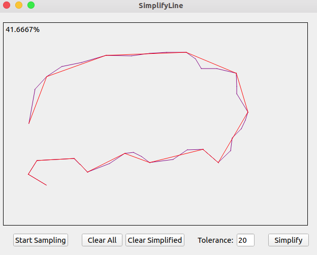
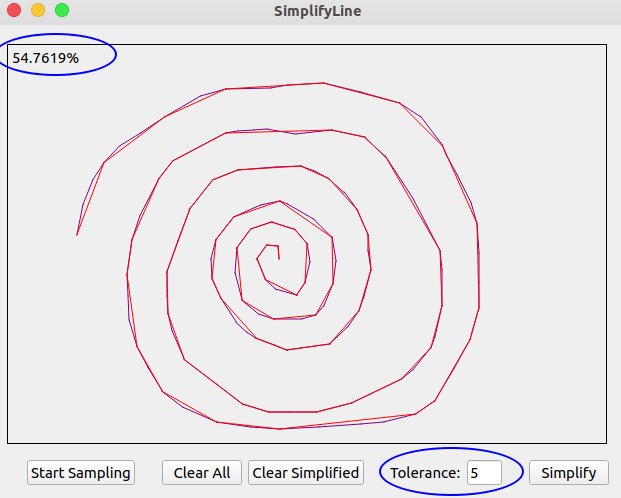
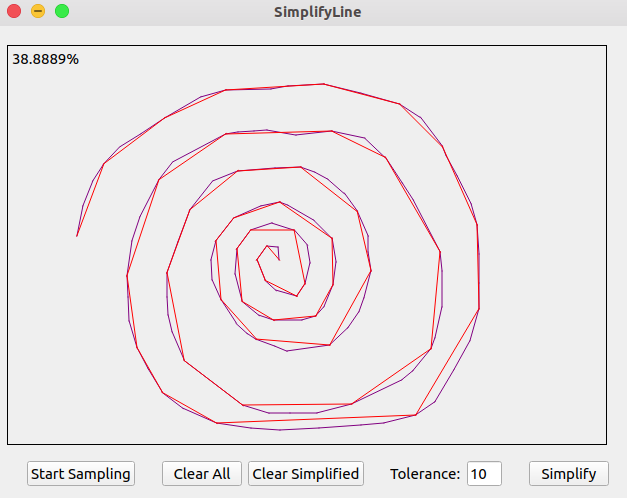
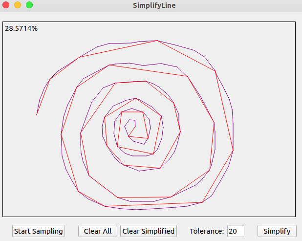

## Douglas-Peucker algorithm

（1）在曲线首尾两点A，B之间连接一条直线AB，该直线为曲线的弦；

（2）得到曲线上离该直线段距离最大的点C，计算其与AB的距离d；

（3）比较该距离与预先给定的容差tolerance的大小，如果小于tolerance，则该直线段作为曲线的近似，该段曲线处理完毕。

（4）如果距离大于容差，则用C将曲线分为两段AC和BC，并分别对两段取信进行1~3的处理。

（5）当所有曲线都处理完毕时，依次连接各个分割点形成的折线，即可以作为曲线的近似。

## Demo

---

(1) Tolerance = 5, CompressRatio = 54.76%

(2) Tolerance = 10, CompressRatio = 38.89%

(3) Tolerance = 20, CompressRatio = 28.57%

## END

<leopard.c@outlook.com>

